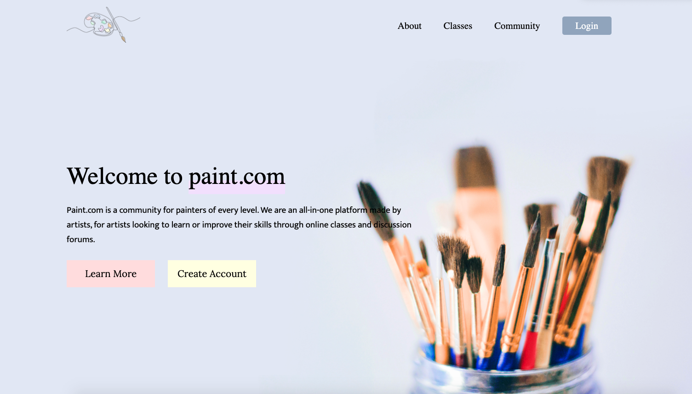
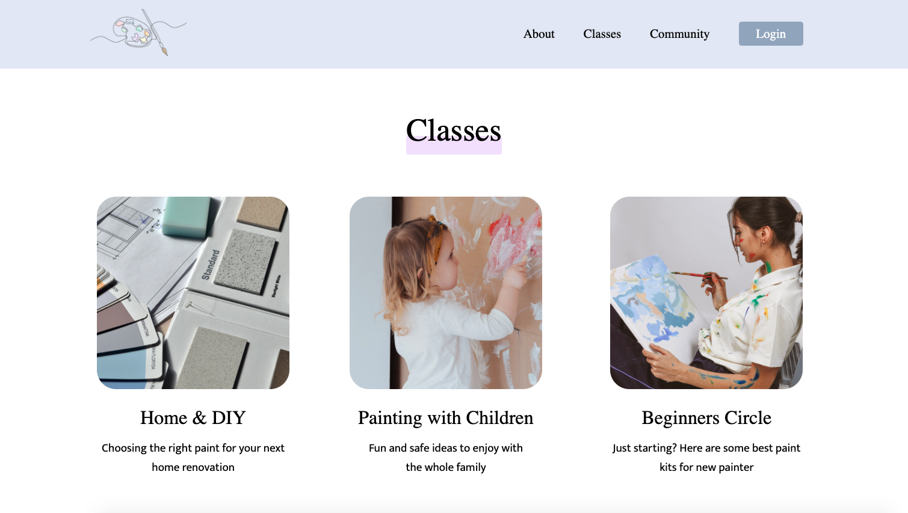
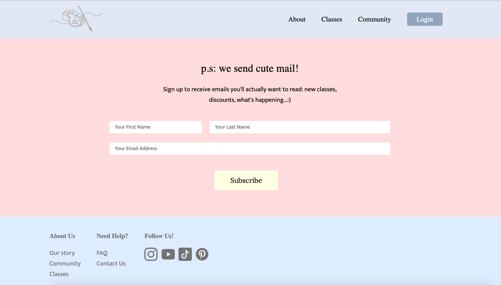
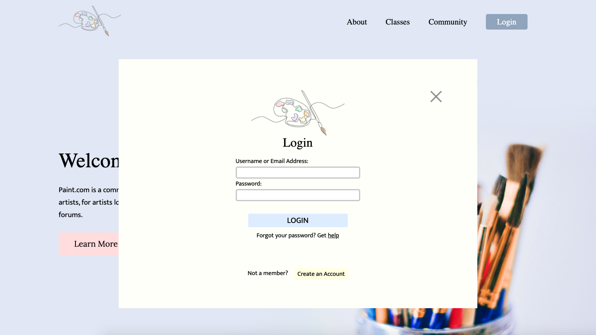
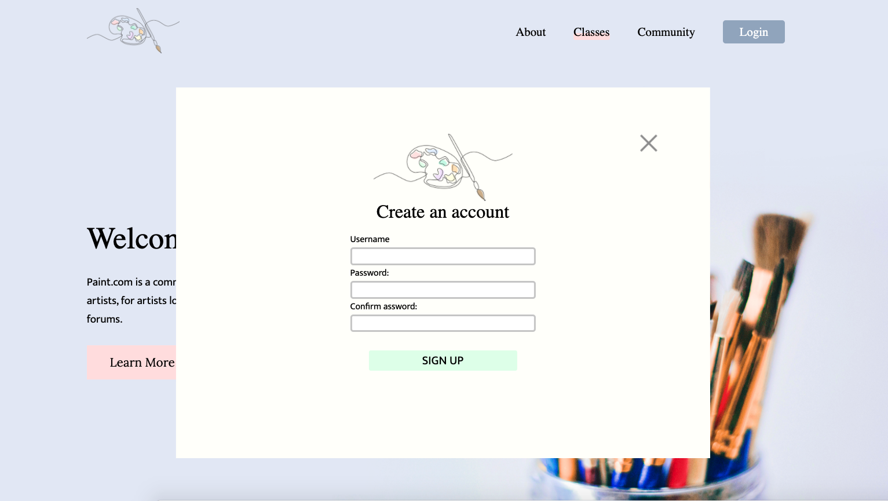

# MDIA4590 Final Project - Paint.com Landing Page
[Live Preview](https://paint.yoonkim.ca)

## Team

- Camille Caringal (Designer)
- Hanna Lu (Designer)
- Vincent Wu (QA Leader)
- Yoon Kim (Web Developer)

## Goal

This is a final project for the MDIA 4590 Quality Asuurance course at BCIT where our team created a fictional art platform 'Paint.com', developed a brand identity, and built a one-page website. The purpose of this project is to work collaborately with the team and produce and test a project in every step by using the tools.

## Project Overview

Paint.com is an all-in-one platform made for artists, by artists looking to improve their skills through online classes and discussion forums. We are dedicated to being the number one platform to fulfill every painter’s need. This site will be mainly for individuals looking to improve their skills through online classes and discussion forums within a safe and supportive community. 	 	

## Features

